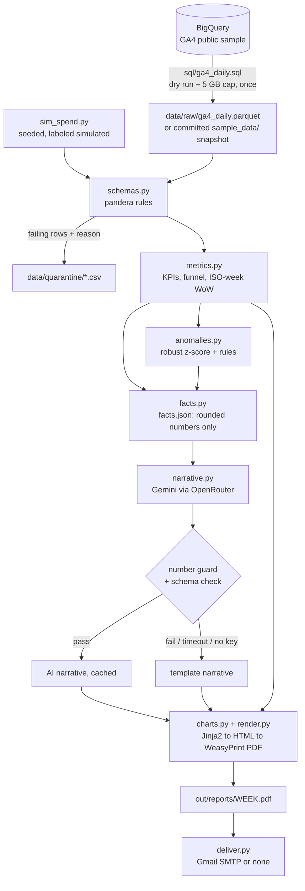

# Marketing Report Engine

Turns raw GA4 e-commerce data into a finished weekly marketing analysis PDF, automatically:
extract once from BigQuery, validate and quarantine bad rows, compute KPIs and week-over-week
changes, detect anomalies, have an LLM write a short **guarded** narrative from the computed
numbers only, render a PDF with charts, and deliver it by email on a schedule.

**Sample reports:** [2020-W48 (Black Friday)](out/samples/2020-W48.pdf) ·
[2021-W02 (planted cost anomaly)](out/samples/2021-W02.pdf) ·
[2021-W04 (revenue tracking gap)](out/samples/2021-W04.pdf)

Data: Google's public [GA4 obfuscated e-commerce sample](https://developers.google.com/analytics/bigquery/web-ecommerce-demo-dataset)
(Google Merchandise Store, 2020-11-01 to 2021-01-31).

## Architecture



Entry points: the `mre` CLI (`src/mre/cli.py`), the FastAPI app (`src/mre/api.py`) and two
GitHub Actions workflows (`ci.yml`, `weekly.yml`).

## Quick start (fresh clone, no cloud accounts needed)

The repository includes a snapshot of the extracted data (`sample_data/ga4_daily.parquet`,
552 rows derived from the public sample), so everything below works without Google Cloud.
Without an OpenRouter key the report uses the template narrative; without Gmail settings
it is only saved.

**Requirements:** Python 3.12+, [uv](https://docs.astral.sh/uv/), and Docker for the PDF
(WeasyPrint needs Pango/Cairo; the Docker image has them).

```bash
git clone <this repo> marketing-report-engine && cd marketing-report-engine
uv sync
cp .env.example .env            # optional: add keys (see Configuration)
uv run mre --help
uv run pytest                   # PDF test is skipped outside Docker/Linux-with-Pango
```

HTML report without Docker (any OS):

```bash
uv run mre run --week 2020-W48 --html-only --no-deliver
```

PDF report with Docker:

```bash
docker build -t mre .
docker run --rm -v "$PWD/out:/app/out" -v "$PWD/data:/app/data" --env-file .env mre run --week 2020-W48 --no-deliver
```

On Windows PowerShell use `${PWD}` instead of `$PWD`. Reports land in `out/reports/`.

### All commands

| Command | What it does |
|---|---|
| `mre extract [--dry-run] [--force]` | BigQuery → `data/raw/ga4_daily.parquet`. Always dry-runs first; refuses above the byte cap. Skips if the cache exists. |
| `mre simulate-spend` | Writes the seeded simulated spend and prints weekly totals. |
| `mre validate` | Runs the pandera rules; failing rows go to `data/quarantine/` with a reason. |
| `mre facts --week W` | Writes `out/facts/W.json`, the only input the LLM sees. |
| `mre narrate --week W` | Runs the guarded LLM narrative and prints it. |
| `mre run --week W [--no-deliver] [--html-only]` | Builds the report and delivers it per `config.yaml`. |
| `mre backfill` | Builds a report for every complete week (13), no delivery. |
| `mre scheduled` | Reports the next week after `out/state.json` (used by the weekly workflow). |
| `mre serve` | API on `127.0.0.1:8000`: `POST /reports {"week": "2020-W48"}`, `GET /reports/{week}`, `/weeks`, `/health`. |

## Configuration

Behavior lives in [`config.yaml`](config.yaml) (validated by Pydantic; unknown keys are
rejected). Secrets live in `.env` (gitignored; see [`.env.example`](.env.example)):

| Variable | Needed for |
|---|---|
| `GCP_PROJECT` | `mre extract` only (plus `gcloud auth application-default login`). The free BigQuery sandbox is enough. |
| `OPENROUTER_API_KEY` | The AI narrative. About $0.0014 per report with `google/gemini-3.1-flash-lite`. |
| `SMTP_USER`, `SMTP_PASSWORD`, `REPORT_RECIPIENTS` | Gmail delivery. Use a Google **app password**, never the account password. |

### Scheduled runs on GitHub

`.github/workflows/weekly.yml` runs every Monday (and on demand). Add repository secrets
(Settings → Secrets and variables → Actions) named `OPENROUTER_API_KEY`, `SMTP_USER`,
`SMTP_PASSWORD` and `REPORT_RECIPIENTS`. All are optional: without the Gmail secrets the job
only builds the PDF and uploads it as a workflow artifact.

**How "weekly" works on a static dataset:** the GA4 sample ends in January 2021, so there
is no real "last week". Each scheduled run reports the *next* complete week of the dataset
after the one recorded in `out/state.json`, commits the updated state, and wraps around after
2021-W04. It simulates a weekly cadence; it does not pretend the data is current.

## Design decisions

1. **The LLM never sees raw data and never does math.** It receives `facts.json`: already
   computed, rounded numbers (rates as percentages), and writes prose. A versioned system
   prompt ([`prompts/narrative_system_v2.md`](prompts/narrative_system_v2.md)) defines each
   field and bans causal wording.
2. **Number guard.** Every number in the LLM text must match a value in `facts.json`
   within rounding (handles `1,234`, `12.5%`, `$1.2k`, `$1.2m`; years, ISO week labels and
   dates are allowed). Otherwise the text is discarded.
3. **The report always generates.** Missing key, API error, timeout, invalid JSON after one
   retry, or a guard failure all fall back to a deterministic template that passes the same
   guard, and the report says which one was used.
4. **Simulated spend is always labeled.** The sample has no ad spend or clicks. Spend is
   generated (budget × seasonality × seeded noise, plus a planted ×2 anomaly in 2021-W02),
   every row has `is_simulated = true`, sessions stand in for clicks (so **cost per
   session**, not CPC), and every page footer says so.
5. **Bad data is quarantined with a reason**, never dropped silently; the report shows the
   count. Structural problems (missing columns) fail loudly instead.
6. **Deterministic.** Seeded simulation (per-channel RNG), sorted outputs, and the same
   input gives byte-identical `facts.json`. Narratives are cached by a hash of the facts,
   model and prompt.
7. **BigQuery is queried once**, with a dry run and a hard `maximum_bytes_billed` cap. The
   full extract scans 1.64 GB of the 1 TB free monthly sandbox allowance.
8. **AI-generated text is labeled** on the page and in the footer.

Data-specific decisions (session-level channel mapping, purchase de-duplication, UTC dates,
ISO-week rules) are documented in [`docs/DATA_NOTES.md`](docs/DATA_NOTES.md).

## Quality

- `ruff`, `mypy --strict` and `pytest` run in CI; coverage is enforced at 80% overall
  (metrics, schemas, anomalies and narrative are each above 88%).
- Every metric formula has a hand-calculated test. Division by zero gives null, never
  infinity. Week-over-week is tested across 2020-W53 → 2021-W01.
- No test calls BigQuery, OpenRouter or Gmail: the clients are faked. An end-to-end test
  runs a tiny synthetic dataset through the whole pipeline to a PDF (inside Docker/CI).

## Limitations

- **Obfuscated sample data.** Placeholders (`<Other>`, `(data deleted)`) and sessions
  without any source put about 35% of sessions in the `unknown` channel. Campaign names are
  over 99% placeholders, so there is no campaign-level analysis.
- **End-of-dataset tracking artifacts.** From 2021-01-22 paid search tagging nearly stops,
  and from 2021-01-26 most purchases have no revenue. 2021-W04 is flagged as a tracking gap
  rather than a sales collapse.
- **Simulated spend.** CPA, ROAS and cost per session illustrate the method only.
- **The guard checks numbers, not meaning.** It cannot tell if a correct number is attached
  to the wrong label. Prompt v2 reduced this (v1 called "71% of purchases without revenue"
  "71% of revenue missing"), but it can still happen. The text is labeled as AI-generated.
- **Store self-referrals** (`shop.googlemerchandisestore.com / referral`) are kept as
  referral, which inflates referral revenue share.
- The API has no authentication and keeps jobs in memory; it binds to localhost.

## Adding a new data source

1. Write a module in `src/mre/sources/` that produces the same **daily channel table** as
   `ga4_bigquery.py` (`EXPECTED_COLUMNS`: date, channel, sessions, funnel sessions,
   purchases, revenue, data-quality counts), cached to Parquet.
2. Map its traffic sources onto the channel labels in `ga4_bigquery.CHANNELS`, or extend
   that tuple. A test keeps the SQL mapping and the schema's channel list in sync.
3. Point `source.raw_path` at the new Parquet. Validation, metrics, anomalies, facts,
   narrative, rendering and delivery work unchanged.
4. For real ad spend, replace `simulate_spend` with a loader returning `date, channel,
   spend, is_simulated=False`; the report labels simulated values only when flagged.

## Project layout

```
src/mre/        config, sources/, schemas, metrics, anomalies, facts, narrative,
                charts, render, deliver, api, state, pipeline, cli
sql/            ga4_daily.sql, channel_case.sql
templates/      report.html.j2
prompts/        versioned LLM system prompts
sample_data/    committed extract snapshot
docs/           DATA_NOTES.md
out/samples/    sample PDFs
tests/          unit, integration and smoke tests
```
